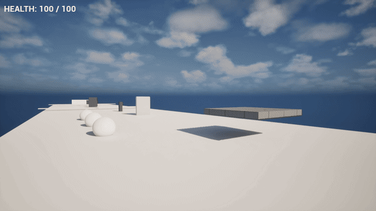

[README.md](https://github.com/user-attachments/files/32971198/README.md)[Uploading # UE5 First Person Gameplay

### Junior Unreal Engine 5 Gameplay Portfolio Project

A first-person gameplay portfolio project developed in **Unreal Engine 5**, focused on learning and demonstrating practical **Blueprint gameplay programming**, player interaction, gameplay systems, and system integration.

The project was built progressively, with each section introducing and implementing a different gameplay mechanic. The final **Mini Gameplay** level combines multiple systems into a small playable scenario.

---

## 🎮 Gameplay Showcase



A small playable first-person scenario combining multiple Blueprint gameplay systems developed throughout the project.

The prototype demonstrates player movement, interactive gameplay elements, obstacles, health feedback and a playable level flow.

---

## 🛠️ Technologies

- **Unreal Engine 5.8**
- **Blueprints**
- **Enhanced Input**
- **UMG (Unreal Motion Graphics)**
- **Git / GitHub**

---

## 🎮 Project Overview

This project explores the development of reusable gameplay mechanics and their integration into a playable first-person prototype.

The project covers:

- Player movement and interaction
- Moving platforms
- Automatic doors
- Button-controlled doors
- Elevator systems
- Pickups and collectibles
- Health and damage
- Enemy interaction
- Enemy patrol movement
- Enhanced Input
- Checkpoints and respawning
- Basic UMG HUD
- Gameplay objectives
- Integration of multiple gameplay systems into a playable level

The project was developed as a learning and portfolio project to build practical experience with **Unreal Engine 5 and Blueprint scripting**.

---

# 📂 Project Structure

```text
Portfolio/
│
├── 01_MovingPlatform/
├── 02_AutomaticDoor/
├── 03_PickupObject/
├── 04_ButtonDoor/
├── 05_Elevator/
├── 06_HealthSystem/
├── 07_SimpleEnemy/
├── 08_InteractionSystem/
├── 09_Simple_Enemy_Patrol/
├── 10_MiniGameplay/
├── 11_Checkpoint_Respawn/
└── 12_Health_HUD/
```

---

# ⚙️ Gameplay Systems

## 01 — Moving Platform

**Blueprint:** `BP_MovingPlatform`

A moving platform system created using a **Blueprint Timeline** and relative transforms.

**Concepts demonstrated:**

- Blueprint Events
- Timelines
- Vector values
- Relative Location
- Transform manipulation
- Event-driven movement

---

## 02 — Automatic Door

**Blueprint:** `BP_AutomaticDoor`

An automatic door that detects the player entering and leaving a trigger area.

```text
Player enters trigger
        ↓
Door opens
        ↓
Player leaves trigger
        ↓
Door closes
```

**Concepts demonstrated:**

- Collision / Overlap Events
- Trigger Volumes
- Timelines
- Relative Rotation
- Event-driven gameplay logic

---

## 03 — Pickup Object

**Blueprint:** `BP_Pickup`

A basic pickup system that detects the player through an overlap event and removes the pickup from the level.

**Concepts demonstrated:**

- `OnComponentBeginOverlap`
- Collision detection
- Player detection
- Actor destruction
- Blueprint gameplay events

---

## 04 — Button-Controlled Door

**Blueprints:**

- `BP_Button`
- `BP_ButtonDoor`

This system demonstrates communication between separate Blueprint Actors.

The button stores a reference to the target door and triggers its custom `OpenDoor` event.

**Concepts demonstrated:**

- Actor References
- Blueprint-to-Blueprint communication
- Custom Events
- Collision / Overlap
- Timelines
- Rotation
- Gameplay interaction

---

## 05 — Elevator

**Blueprint:** `BP_Elevator`

A trigger-based elevator system that moves the elevator vertically when activated.

**Concepts demonstrated:**

- Trigger Volumes
- Overlap Events
- Timelines
- Relative Location
- Vector manipulation
- Event-driven movement

---

# ❤️ 06 — Health & Damage System

This module introduces a reusable player health and damage system.

### Main Blueprints

- `BP_PlayerHealth`
- `BP_DamageZone`

The player has a health value which can be modified through the `TakeDamage` event.

Damage zones detect the player through collision overlap and apply damage to the player's health system.

```text
Damage Zone
     ↓
Player Overlap
     ↓
Player Reference
     ↓
TakeDamage
     ↓
Health -= Damage
     ↓
Health State Check
```

**Concepts demonstrated:**

- Blueprint Variables
- Numeric operations
- Events
- Collision detection
- Casting
- Functions / Custom Events
- Branch conditions
- Gameplay state checks
- Health management

---

# 👾 07 — Simple Enemy

**Blueprint:** `BP_SimpleEnemy`

A basic enemy interaction system that detects the player inside an attack trigger and applies damage through the player's health system.

**Concepts demonstrated:**

- Collision / Overlap
- Player detection
- Blueprint Casting
- Blueprint communication
- Damage application
- Integration with Health System

---

# 🎯 08 — Interaction System

This module introduces player interaction using **Enhanced Input**.

### Main elements

- `IA_Interact`
- `BP_InteractDoor`
- Player Character

**Concepts demonstrated:**

- Enhanced Input
- Input Actions
- Blueprint Events
- Actor References
- Custom Events
- Interactive gameplay
- Timeline-based animation

---

# 🚶 09 — Simple Enemy Patrol

**Blueprint:** `BP_EnemyPatrol`

A basic enemy patrol system created using a Blueprint Timeline and vector interpolation.

> This is a simple scripted patrol system rather than a full AI Navigation / Behaviour Tree implementation.

**Concepts demonstrated:**

- Timeline
- Actor Location
- Vector interpolation
- `Lerp`
- Vector construction
- Movement direction
- Blueprint variables
- Event-driven movement

---

# 🏁 10 — Mini Gameplay

**Map:** `LVL_MiniGameplay`

The Mini Gameplay level combines several previously developed systems into one playable scenario.

### Included systems

- Moving platforms
- Automatic doors
- Button-controlled doors
- Elevator
- Damage zones
- Enemy interactions
- Enemy patrol
- Collectibles
- Checkpoints
- Respawn
- Player health
- Health HUD
- Final goal

### Collectible System

**Blueprint:** `BP_10_Collectible`

The collectible system detects the player, updates gameplay progress and removes the collected object.

---

# 🏆 Goal System

**Blueprint:** `BP_10_Goal`

The Mini Gameplay level contains a goal trigger used to define the end of the playable scenario.

```text
Explore
  ↓
Interact
  ↓
Collect Objectives
  ↓
Avoid / Receive Damage
  ↓
Activate Checkpoints
  ↓
Reach Goal
```

---

# 🚩 11 — Checkpoint & Respawn

**Blueprint:** `BP_11_Checkpoint`

The checkpoint system stores the player's location when a checkpoint is activated.

The player character contains respawn functionality that uses the stored checkpoint location.

**Concepts demonstrated:**

- Trigger Volumes
- Actor Location
- Variables
- Player References
- Respawn Logic
- State Persistence
- Health Reset
- Blueprint Communication

---

# 🖥️ 12 — Health HUD

**Widget:** `WBP_12_HealthHUD`

A basic dynamic HUD created using **UMG**.

The widget retrieves the player's health value and displays it on screen.

```text
HEALTH: 100 / 100
```

**Concepts demonstrated:**

- UMG
- Widget Blueprint
- UserWidget
- Dynamic text
- Player data access
- Blueprint Casting
- Widget creation
- Viewport integration

---

# 🎮 Player Character

**Blueprint:** `BP_FirstPersonCharacter`

The player character acts as the main integration point for several gameplay systems.

It contains or interacts with:

- Player movement
- Jump
- Camera look
- Enhanced Input
- Interaction
- Health
- Damage
- Respawn
- Checkpoint location
- Health reset
- Interactive doors
- Health HUD

---

# 🎛️ Enhanced Input

### Input Actions

```text
IA_Move
IA_Jump
IA_Look
IA_MouseLook
IA_Interact
```

### Input Mapping Contexts

```text
IMC_Default
IMC_MouseLook
```

Enhanced Input is used for player movement, camera control and interaction.

---

# 🧠 What I Learned

Through the development process, I gained practical experience with:

- Unreal Engine 5 Editor
- Blueprint visual scripting
- Event-driven programming
- Gameplay state logic
- Variables and data flow
- Branches and conditional logic
- Functions and Custom Events
- Timelines
- Collision and Overlap events
- Actor References
- Blueprint communication
- Casting
- Transform manipulation
- Vector operations
- Enhanced Input
- Player health and damage
- Checkpoints and respawning
- Basic UMG widgets
- Gameplay debugging
- Git and GitHub
- Integrating multiple systems into a playable prototype

---

# 📸 Media

The `Media/` directory contains the current gameplay showcase assets.

Additional technical Blueprint screenshots can be added here:

```text
Media/
├── mini-gameplay.gif
├── mini-gameplay.png
├── health-damage.png
├── blueprint-communication.png
├── checkpoint-respawn.png
├── health-hud.png
└── health-hud-blueprint.png
```

---

# 🎯 Project Goals

1. Build a practical foundation in Unreal Engine 5.
2. Learn Blueprint-based gameplay programming.
3. Understand how individual gameplay systems communicate.
4. Practice debugging and problem solving.
5. Explore Enhanced Input.
6. Gain introductory experience with UMG.
7. Combine multiple mechanics into a playable prototype.
8. Create a portfolio project demonstrating practical Unreal Engine skills.

---

# 🔧 Future Improvements

Possible future improvements include:

- More advanced enemy AI
- Navigation-based enemy movement
- Behaviour Trees
- More advanced UMG systems
- Audio feedback
- Visual effects
- More polished gameplay feedback
- Additional gameplay objectives
- Improved level design
- Expanded player interaction systems
- Additional gameplay states

---

# 📌 Project Status

**Playable portfolio prototype**

The core gameplay systems are implemented and functional. The project is primarily intended to demonstrate learning progress, Blueprint gameplay programming and Unreal Engine 5 development skills.

---

## 👤 Developer

**Lukyi124**

Junior Unreal Engine / Gameplay Developer

**Focus:**

`Unreal Engine 5` · `Blueprints` · `Gameplay Systems` · `Enhanced Input` · `UMG` · `Git/GitHub`

---

## 📄 License

This project is a personal learning and portfolio project.
README.md…]()
